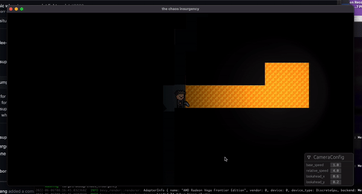

# bevy_sprite3d

[](https://crates.io/crates/bevy_sprite3d)
[](./license.md)

Use 2d sprites in a 3d [bevy](https://bevyengine.org/) scene.

This is a pretty common setup in other engines (unity, godot, etc). Useful for:

- 2d games using bevy's lighting `(orthographic camera, 3d sprites)`
- 2d games with easier parallax and scale `(perspective camera, 3d sprites)`
- 2d games in a 3d world `(perspective camera, both 3d sprites and meshes)`
- 3d games with billboard sprites (a la
  [Delver](https://cdn.cloudflare.steamstatic.com/steam/apps/249630/ss_0187dc55d24155ca3944b4ccc827baf7832715a0.1920x1080.jpg))

Both meshes and materials are internally cached, so this crate can be used for
things like tilemaps without issue.

# Examples

Example using `bevy_sprite3d`:



A more complicated scene: [`examples/dungeon.rs`](./examples/dungeon.rs). Try
this one with `cargo run --example dungeon`.

https://github.com/FraserLee/bevy_sprite3d/assets/30442265/1821b13c-9770-4f4e-a889-f67e06a3cda6

Some more examples. These don't use bevy, but demonstrate the effect style:


# Usage

Check out the [examples](./examples) for details. Tl;dr initialize the plugin with

```rust
app.add_plugin(Sprite3dPlugin)
```

and spawn sprites with

```rust
fn setup(
    mut commands: Commands,
    images: Res<ImageAssets>, // this is your custom resource populated with asset handles
) {

    // ----------------------- Single Static Sprite ----------------------------

    commands.spawn((
        Sprite {
            image: images.sprite.clone(),
            ..default()
        },
        Sprite3d {
            pixels_per_metre: 400.,

            partial_alpha: true,

            unlit: true,

            ..default()

            // pivot: Some(Vec2::new(0.5, 0.5)),
            // double_sided: true,
        }
    ));

    // ------------------- Texture Atlas (Sprite Sheet) ------------------------

    let texture_atlas = TextureAtlas {
        layout: images.layout.clone(),
        index: 3,
    };

    commands.spawn((
        Sprite {
            image: images.sprite_sheet.clone(),
            texture_atlas: Some(texture_atlas),
            ..default()
        },
        Sprite3d {
            pixels_per_metre: 32.,
            partial_alpha: true,
            unlit: true,

            ..default()

            // pivot: Some(Vec2::new(0.5, 0.5)),
            // double_sided: true,
        }
    ));
}
```

Images don’t need to be fully loaded before you spawn. If they aren’t ready yet, bevy_sprite3d waits asynchronously and finishes the mesh/material once the asset loads. Preloading just avoids the (brief) delay before the sprite shows up. The dungeon example still shows how to do this with Bevy's `States`.

## Material handling

- If you do NOT supply a material: a cached `StandardMaterial` is reused or created, tinted with `Sprite.color`.
- To tint without a custom material, just use `Sprite.color`.
- If you supply a `MeshMaterial3d<StandardMaterial>` before adding `Sprite3d`: that material is kept; only these fields may be changed:
  - `base_color_texture` (always set to the sprite's image)
  - `alpha_mode` (only if you chose a non-default on `Sprite3d`)
  - `unlit` (can be forced true, never forced false)
  - `emissive` (if non-black on `Sprite3d`)
  - flips via `flip_x` / `flip_y`
- Everything else (base_color, roughness, reflectance, maps, cull_mode, etc.) is preserved exactly.

Custom material example:

```rust
let custom = materials.add(StandardMaterial { base_color: Color::srgb(0.8,0.2,0.2), perceptual_roughness: 0.9, reflectance: 0.05, ..default() });
commands.spawn((
        Sprite { image: images.enemy.clone(), ..default() },
        MeshMaterial3d(custom),
        Sprite3d { unlit: true, emissive: LinearRgba::rgb(0.2,0.05,0.05), ..default() }
));
```

## Versioning

| `bevy_sprite3d` version | `bevy` version |
| ----------------------- | -------------- |
| 6.0                     | 0.16.0         |
| 5.0.0                   | 0.16.0         |
| 5.0.0-rc                | 0.16.0-rc      |
| 4.0                     | 0.15           |
| 3.0                     | 0.14           |
| 2.8                     | 0.13           |
| 2.7                     | 0.12           |
| 2.5 - 2.6               | 0.11           |
| 2.4                     | 0.10           |
| 2.1 - 2.3               | 0.9            |
| 1.1 - 2.0               | 0.8            |
| 1.0                     | 0.7            |
